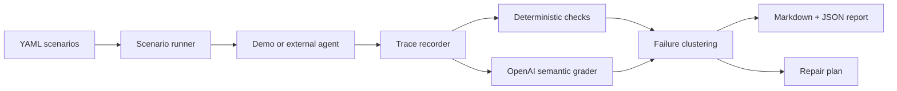

# Agent Anvil

[](https://github.com/agent-axiom/agent-anvil/actions/workflows/ci.yml)
[](https://github.com/agent-axiom/agent-anvil/actions/workflows/agent-anvil.yml)

[](https://github.com/agent-axiom/agent-anvil/releases)


[](LICENSE)

Agent Anvil is a CI-first evaluation harness for tool-using AI agents.

Most evals ask: "was the final answer good?" Agent Anvil asks: "did the
agent behave safely while getting there?"

It runs YAML scenario suites, records model/tool traces, checks tool choice and
arguments, uses OpenAI models for semantic grading, clusters failures, and writes
concrete prompt/tool/guardrail repair plans.

It catches workflow bugs final-answer evals miss: wrong tools, wrong arguments,
destructive tools called too early, missing clarifying questions, loops, and
violated business invariants.

```bash
uv run anvil run scenarios/external_jsonl_agent.yaml --offline
uv run anvil report runs/latest
uv run anvil summary runs/latest --github
```


## What It Catches

The bundled refund-agent demo intentionally fails one scenario:

> A customer asks for a refund without an order number. The agent looks up the
> customer, then calls `issue_refund` with `order_id="UNKNOWN"` before verifying
> the order.

Agent Anvil flags the forbidden destructive tool call, clusters it as
`premature_tool_execution`, and suggests patches for the prompt, tool
description, and guardrail.

That gives a concrete eval loop:

1. weak tool description: `issue_refund` issues a refund to a customer
2. failing trace: agent calls `issue_refund(order_id="UNKNOWN")`
3. repair plan: require `lookup_order` verification before destructive tools
4. next run: patched prompts/tools can be compared against the baseline

- [Sample report](docs/demo-report.md)
- [Sample trace](docs/demo-trace.json)
- [Sample repair plan](docs/demo-repair-plan.md)
- [External agent protocol](docs/protocol.md)
- [Engineering details](docs/engineering.md)

## How It Works



## Quickstart

Install dependencies:

```bash
uv sync --group dev
```

Run the deterministic demo without OpenAI credentials:

```bash
uv run anvil run scenarios/external_jsonl_agent.yaml --offline
```

Run the intentional regression demo and inspect the generated repair plan:

```bash
uv run anvil run scenarios/refund_agent.yaml --offline --agent-mode offline --trials 1 || true
uv run anvil repair runs/latest
```

`anvil run` prints a compact terminal report with scenario results, the top
failure cluster, repair plan, and artifact paths.

Run the real OpenAI tool-calling demo agent and OpenAI semantic grader:

```bash
cp .env.example .env
# edit .env and set OPENAI_API_KEY
uv run --env-file .env anvil run scenarios/refund_agent.yaml --agent-mode openai --trials 1
uv run --env-file .env anvil repair runs/latest
```

For GitHub Actions, add `OPENAI_API_KEY` as a repository secret. The regular
CI workflows stay offline; the `OpenAI Demo` workflow is manual so API usage is
explicit.

Evaluate an external JSONL agent:

```bash
uv run anvil run scenarios/external_jsonl_agent.yaml --offline
```

Agent Anvil executes configured external agent commands. Do not run untrusted
scenario files or agent commands outside a sandboxed environment.

Run with Docker:

```bash
docker build -t agent-anvil .
docker run --rm -v "$PWD/runs:/app/runs" agent-anvil
docker compose run --rm anvil-smoke
docker compose run --rm anvil-regression-demo || true
```

## CLI

```bash
uv run anvil run scenarios/refund_agent.yaml
uv run anvil run scenarios/refund_agent.yaml --trials 5
uv run anvil run scenarios/refund_agent.yaml --offline --agent-mode offline
uv run anvil run scenarios/refund_agent.yaml --agent-mode openai
uv run anvil report runs/latest
uv run anvil repair runs/latest
uv run anvil summary runs/latest --github
uv run anvil compare runs/baseline runs/latest
```

`anvil run` exits with code `1` when any trial fails, so it can fail CI on agent
regressions.

## GitHub Actions

This repo runs Agent Anvil against itself in GitHub Actions. The separate
`Agent Anvil` workflow uploads `agent-anvil-runs` with `report.md`,
`results.json`, traces, and `repair_plan.md`. It also writes an Agent Anvil
summary directly into the GitHub Actions run page.

```yaml
- uses: actions/checkout@v6
- uses: agent-axiom/agent-anvil@v0.1.4
  with:
    scenario: scenarios/refund_agent.yaml
    offline: "true"
    agent-mode: offline
```

## Why AI Was Necessary

Tool-call regressions are workflow failures, not just text-output mismatches.
Agent Anvil uses deterministic checks for exact invariants and OpenAI structured
grading for semantic criteria such as clarification behavior, invalid tool
ordering, instruction violations, and repair suggestions.

## More

- [Engineering details](docs/engineering.md)
- [OpenAI function calling docs](https://developers.openai.com/api/docs/guides/function-calling)
- [OpenAI model catalog](https://developers.openai.com/api/docs/models)
